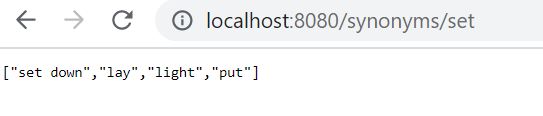

# Synonyms REST API

## Description

REST API using JAVA, Spring Boot and Maven that allows to enter an English word in URL path and receive all synonyms of the word as response. Synonym data is taken from [Dictionary API](https://dictionaryapi.dev/)

## Setup

Just clone this repository

## Usage

1. Open command line/console of Your system with a user account that has admin rights
2. Go to the directory where the project was previously cloned
3. Run the app via command `mvnw spring-boot:run`

### Endpoints

Available from localhost on port 8080: [http://localhost:8080/](http://localhost:8080/)

#### `GET /synonyms/{word}`

Enter the necessary word to get its synonyms as a list in the response page 

##### Example

## Tests

The unit tests of the app can be run via  `mvnw test`